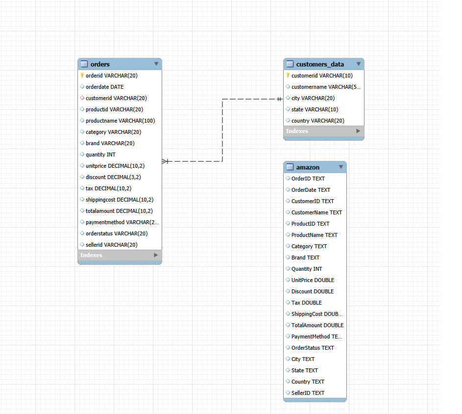
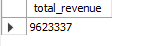
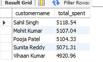
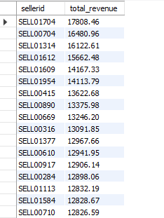
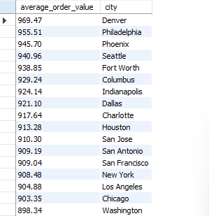

# Amazon Sales (E-Commerce-Analysis-SQL-Project)

SQL analysis of an e-commerce platform's sales, customers, products, sellers, orders, and revenue using MySQL.

## 🛠️ Tools Used

* MySQL
* MySQL Workbench
* SQL

## 📊 Dataset Source

The original Amazon.csv dataset was imported into MySQL and then cleaned and transformed into two custom relational tables:

customers_data — contains customer-related information such as customer ID, customer name, city, state, and country.
orders — contains order-related information such as order ID, order date, customer ID, product details, quantity, price, payment method, order status, seller ID, and total amount.

This table structure was created to separate customer information from order transaction data and establish a relationship between the tables using customerid.

**Dataset:** [Amazon Sales Dataset](https://www.kaggle.com/datasets/rohiteng/amazon-sales-dataset)

The raw dataset is stored in the `Raw_data` folder.

## 🗂️ Project Structure

```text
E-Commerce-Analysis-SQL-Project/
│
├── README.md
│
├── schema/
│   └── Schema_creation.sql
│
├── Raw_data/
│   └── Amazon.csv
│
├── queries/
│   ├── beginner.sql
│   ├── Intermediate.sql
│   └── Advanced.sql
│
└── Screenshots/
    ├── result_screenshots/
    │   ├── total_revenue.png
    │   ├── top_category.png
    │   ├── top_customers.png
    │   ├── top_sellers.png
    │   └── average_order_city.png
    |    └── other screenshots
    │
    └── ER.png

```

## 🔗 ER Diagram

The database was organized into related tables using primary keys and foreign keys.



## 🔍 Key Business Questions

### 1. What is the total revenue generated?

```sql
select sum(totalamount) as total_revenue
from orders;
```

**Purpose:** Calculates the total revenue generated from all orders.

**Result:**



---

### 2. Which product category sold the most units?

```sql
select category, sum(quantity) as total_units
from orders
group by category
order by total_units desc
limit 1;
```

**Purpose:** Identifies the product category with the highest number of units sold.

**Result:**


---

### 3. Who are the top 5 customers by total spending?

```sql
select c.customername, sum(o.totalamount) as total_spent
from customers_data c
join orders o
    on c.customerid = o.customerid
group by c.customerid, c.customername
order by total_spent desc
limit 5;
```

**Purpose:** Identifies the customers who have spent the most.

**Result:**



---

### 4. Which sellers generated more than 10,000 in revenue?

```sql
select sellerid, sum(totalamount) as total_revenue
from orders
group by sellerid
having sum(totalamount) > 10000
order by total_revenue desc;
```

**Purpose:** Identifies sellers whose total revenue exceeds 10,000.

**Result:**



---

### 5. What is the average order value per city?

```sql
select c.city, avg(o.totalamount) as average_order_value
from orders o
join customers_data c
    on c.customerid = o.customerid
group by c.city
order by average_order_value desc;
```

**Purpose:** Compares the average order value across different cities.

**Result:**



## 📚 What I Learned

Through this project, I practiced SQL concepts for analyzing real-world e-commerce data and answering business-related questions. I learned how to use joins, aggregate functions, grouping, filtering, views, and stored procedures to extract useful insights from relational data.

I also gained practical experience designing tables using primary keys and foreign keys and creating an ER diagram in MySQL Workbench.

## 📌 SQL Concepts Practiced

* `select`
* `where`
* `order by`
* `group by`
* `having`
* `joins`
* `sum()`
* `avg()`
* `count()`
* `max()`
* Subqueries
* Views
* Stored procedures
* Date filtering
* Primary keys
* Foreign keys
* ER diagrams
